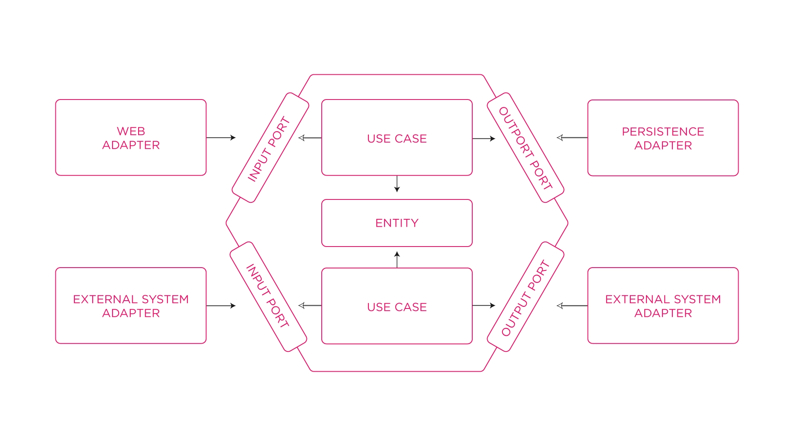

# java-hexagonal
Aplicação feita em java, para desenvolver o conhecimento sobre a arquitetura hexagonal


# Nome do projeto




> Este projeto consiste em uma aplicação criada com java/spring Rest, aplicando a arquitetura hexagonal. 

### Ajustes e melhorias

O projeto ainda está em desenvolvimento e as próximas atualizações serão voltadas para as seguintes tarefas:

- [ ] Tarefa 1: Implementação de testes unitário e integração
- [ ] Tarefa 2: Implementação de outras entidade referentes ao dominio de fastfoo
- [ ] Tarefa 3: Implementar docker
- [ ] Tarefa 4: Implementar CI/CD
- [ ] Tarefa 5: Implementar K8S (Kubernetes) 

## 💻 Pré-requisitos

Antes de começar, verifique se você atendeu aos seguintes requisitos:

- Você instalou a versão mais recente de `<linguagem: Java 21 >`
- Você tem uma máquina `<Windows / Linux / Mac>`. Compativel com todos os sitemas operacionais.


## 🚀 Instalando java-hexagonal

Para instalar o java-hexagonal, siga estas etapas:

Linux e macOS:

```
Vou gerar a imagem e subir para o dockerHub
```

Windows:

```
Vou gerar a imagem e subir para o dockerHub
```


## 📫 Contribuindo para java-hexagonal

Para contribuir com <nome_do_projeto>, siga estas etapas:

1. Bifurque este repositório.
2. Crie um branch: `git checkout -b <nome_branch>`.
3. Faça suas alterações e confirme-as: `git commit -m '<mensagem_commit>'`
4. Envie para o branch original: `git push origin <nome_do_projeto> / <local>`
5. Crie a solicitação de pull.

Como alternativa, consulte a documentação do GitHub em [como criar uma solicitação pull](https://help.github.com/en/github/collaborating-with-issues-and-pull-requests/creating-a-pull-request).


## 📝 Licença

Esse projeto está sob licença. Veja o arquivo [LICENÇA](LICENSE) para mais detalhes.


## 🤝 Autor

[Robson Arcoleze](https://www.linkedin.com/in/robsonarcoleze/)
